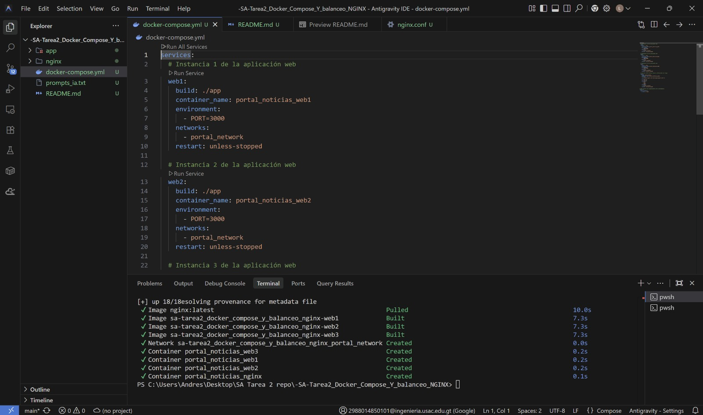
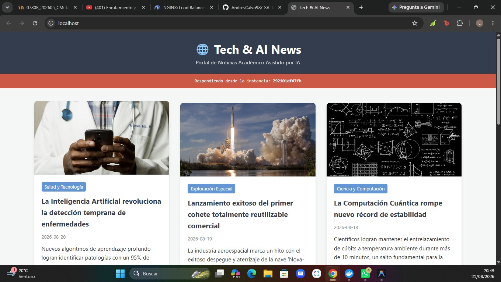
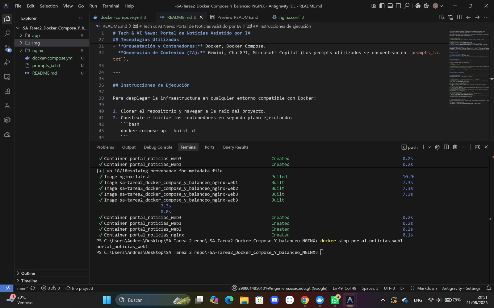
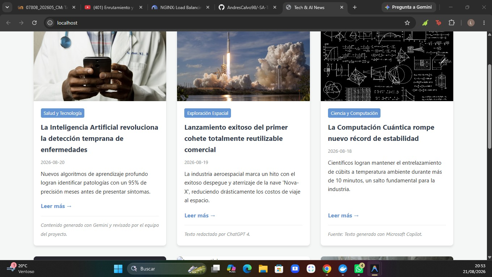

# Tech & AI News: Portal de Noticias Asistido por IA


**Autor:** Luis Andres Calvo Arreaga - 201712620

Proyecto académico para la materia de **Sistemas Abiertos**. Implementación de una arquitectura de microservicios contenerizada con Docker Compose, utilizando NGINX como proxy inverso y balanceador de carga para un portal web de noticias cuyo contenido ha sido generado mediante Inteligencia Artificial.

---

## Arquitectura de la Solución

La infraestructura del proyecto sigue un patrón clásico de **Proxy Inverso con Balanceador de Carga**. 

1. **NGINX (Punto de entrada único):** Recibe las solicitudes HTTP externas en el puerto `80`.
2. **Upstream (Balanceador):** NGINX distribuye estas peticiones al grupo de servidores backend `noticias_app`.
3. **Instancias Backend:** El backend está conformado por **3 contenedores independientes** (`web1`, `web2`, `web3`) que ejecutan la aplicación Node.js/Express.

### Algoritmo de Balanceo: Round Robin
Se ha implementado el algoritmo predeterminado de NGINX: **Round Robin**. Este método distribuye las peticiones entrantes de manera secuencial y rotativa entre los servidores disponibles (A -> B -> C -> A...). Se eligió este algoritmo dado que todas las instancias ejecutan la misma imagen y poseen capacidades de procesamiento idénticas, garantizando así una distribución equitativa de la carga.

---

## Tecnologías Utilizadas

- **Frontend & Backend:** Node.js, Express.js, EJS (Motor de plantillas).
- **Servidor Web / Proxy Inverso:** NGINX.
- **Orquestación y Contenedores:** Docker, Docker Compose.
- **Generación de Contenido (IA):** Gemini, ChatGPT, Microsoft Copilot (Los prompts utilizados se encuentran en `prompts_ia.txt`).

---

## Instrucciones de Ejecución

Para desplegar la infraestructura en cualquier entorno compatible con Docker:

1. Clonar el repositorio y navegar a la raíz del proyecto.
2. Construir e iniciar los contenedores en segundo plano ejecutando:
   ```bash
   docker-compose up --build -d
   ```



3. Una vez iniciados los servicios, el portal estará accesible en el navegador a través de: **http://localhost** (o `http://127.0.0.1`).

---

## Pruebas y Evidencias de Funcionamiento

A continuación se documentan las pruebas realizadas para validar los requisitos de la rúbrica.

### 1. Balanceo de Carga Activo
Para demostrar la distribución del tráfico, la aplicación web inyecta de forma dinámica el identificador único del contenedor (hostname) en un banner rojo en la parte superior de la interfaz. 

Al recargar la página repetidamente, el identificador cambia, evidenciando el funcionamiento del balanceador Round Robin.




### 2. Tolerancia a Fallos y Alta Disponibilidad
El sistema está diseñado para mantener el servicio activo incluso si una instancia falla. Para comprobarlo:
1. Se detuvo manualmente uno de los contenedores web:
   ```bash
   docker stop portal_noticias_web1
   ```
2. Al continuar navegando, NGINX detecta automáticamente la inactividad del nodo y lo retira del grupo, redirigiendo el tráfico únicamente a las instancias restantes.




### 3. Enrutamiento y Accesibilidad
Además de la ruta principal (`/`), NGINX maneja rutas específicas:
- `/noticia/:id`: Enrutamiento interno gestionado por Express para el detalle de cada noticia.
- `/api/info`: Ruta de demostración para respuestas en formato JSON.



---

## Uso Responsable de Inteligencia Artificial

Las noticias presentadas en este portal son simulaciones creadas con fines académicos utilizando Modelos de Lenguaje Grande (LLMs). 
- Se ha incluido una **advertencia visible** en el pie de página y en el detalle de cada artículo indicando que el contenido no es información periodística verificada.
- En cada noticia se atribuye explícitamente la herramienta utilizada (ej. Gemini, ChatGPT).
- Los prompts fuente se pueden auditar en el archivo `prompts_ia.txt` de este repositorio.

---
